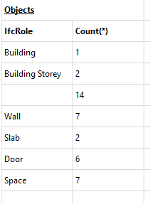

# How to get a list of arch objects by role

Add the following statement to the Report

```sql
Select IfcRole, Count(*)
From document 
Group by IfcRole;
```

And you will get a Result like this



There is a empty entry in the list. This is because some objects like Sketches or Groups don't have a IfcRole attribute. We can filter them out easily by changing the query to this

```sql
Select IfcRole, Count(*)
From document 
Where IfcRole IS NOT NULL
Group by IfcRole;
```