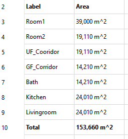

# How to add a Result Row for a Statement

Lets say we want a list of rooms in our house and the total amount of living area. To do so we add the following statement to the report and check ```Skip empty rows after Statement```.

```sql
Select Label, Area
From document
Where IfcRole = 'Space'
```

Next add the following statement and check ```Skip Column Names``` and ```Print Result in Bold```

```sql
Select 'Total', Sum(Area) 
From document
Where IfcRole = 'Space'
```

And you will get a Result like this:



There is no empty space between the two statements, the column names for the second statement is not printed and the second statement is printed in bold. A perfect result row.
