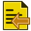

# How to create a report collection

If you work on multiple projects, it is very likely that you want to use the same reports over and over again. This is pretty easy to achieve.

Lets assume you have a document and you already created some reports there. Now select a report and click the `Export Report` button.


A file dialog will be shown. Now select a folder and enter a name for the Report.
This command creates a JSON file. This is a simple text file. So you can open it with your favourite text editor if you want and check out its content. But it might look something like this:

```json
{
    "statements": [
        {
            "header": "Test",
            "htmlStatement": "<!DOCTYPE HTML PUBLIC \"-//W3C//DTD HTML 4.0//EN\" \"http://www.w3.org/TR/REC-html40/strict.dtd\">\n<html><head><meta name=\"qrichtext\" content=\"1\" /><style type=\"text/css\">\np, li { white-space: pre-wrap; }\n</style></head><body style=\" font-family:'MS Shell Dlg 2'; font-size:8.25pt; font-weight:400; font-style:normal;\">\n<p style=\" margin-top:0px; margin-bottom:0px; margin-left:0px; margin-right:0px; -qt-block-indent:0; text-indent:0px;\">Select count(*) from document</p></body></html>",
            "plainTextStatement": "Select count(*) from document",
            "printResultInBold": true,
            "skipColumnNames": true,
            "skipRowsAfter": true
        }
    ]
}
```

Now when you start a new project, you can click the `Import Report` button.



Again a file dialog will be shown. Select the previously saved file and a Report will be created in your document with the same contents as the one we exported earlier.
