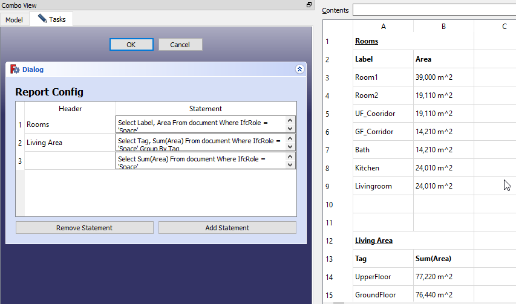
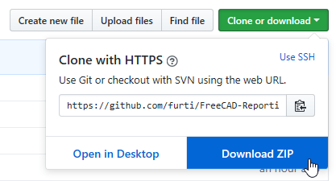
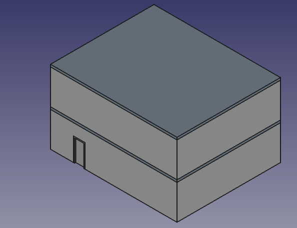
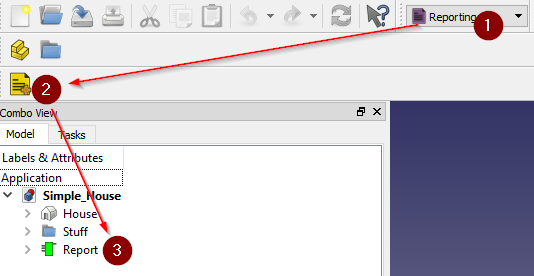
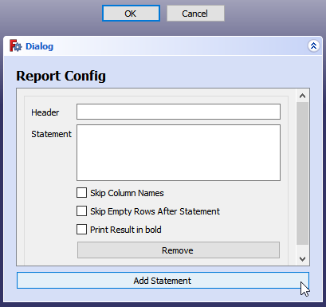
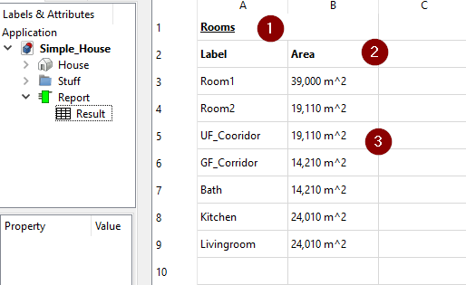
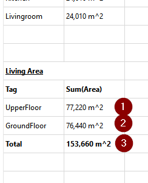

# FreeCAD-Reporting
The Reporting Workbench makes it possible to extract informations out of a FreeCAD document pretty easily. It can be used via Python or via the GUI. A bit like the "Arch Schedule" Tool on steroids ;)




## Motivation

I was working on an personal Architecture Project. After there where a lot of walls, windows, doors etc. in the model, I needed an easy way to get the information out of the model. I was not happy with the arch schedule tool, as I think it is not as flexible as it could be. As I work with SQL (Structured Query Language https://en.wikipedia.org/wiki/SQL) a lot during work, I decided to give it a try and create a SQL Module for FreeCAD.

## Getting started

<details>
<summary>
This section gives you a step by step introduction on how to get startet with the workbench. It will guide you through the process of creating a simple report to extract some data out of a FreeCAD Document.

more...
</summary>
    
1. First you should download the Reporting Workbench. It is not in the addon manager right now. So download the ZIP from this repository and copy it to your FreeCAD Addon directory (https://www.freecadweb.org/wiki/How_to_install_additional_workbenches)



2. Next you should download the sample File [Simple_House.FCStd](./Documentation/Simple_House.FCStd) and open it in FreeCAD. Now you should see something like this.


    
This file contains a simple House with some rooms and doors. Its not pretty, but it should be good enough to extract some data out of it ;)

3. Now that the file is set up, we should fire up the report workbench and create our first report.



4. Now we have a empty Report object. Lets fill it with data. Lets say we want to query some informations about the rooms inside the house. Double click the ```Report``` object in the Treeview and the configuration shows up. Click ```Add Statement``` to add a new statement.



5. Now fill in "Rooms" into the ```Header``` field and the following statement into the ```Statement``` field

```sql
Select Label, Area
From document
Where IfcRole = 'Space'
```

6. Click ```OK```. The Task dialog closes and the report recomputes.

7. Expand the Report in the Treeview and you should see a Spreadsheet named ```Result```. Double click on it to see its content.



What do we see here?
 - (1) The header we added in the Report Config
 - (2) The column names extracted from our statement
 - (3) The list of objects matching our statement and the values extracted for each column

8. This is pretty good. But I think we can do even better. Double click the Report in the Treeview again. Click on ```Add Statement``` and add "Living Area" in the ```Header``` field and the following in the ```Statement``` field:

```sql
Select Tag, Sum(Area)
From document
Where IfcRole = 'Space'
Group By Tag
```

9. Click ```Add Statement``` once again and leave the ```Header``` field empty and add the following to the ```Statement``` field:

```sql
Select Sum(Area)
From document
Where IfcRole = 'Space'
```

10. If you look at the ```Result``` Spreadsheet again you see that there is some more data below the room list now



 - (1) The living area on the upper floor
 - (2) The living area on the ground floor
 - (3) And the overall living area for the entire building

11. This is the end of the getting started guide. Whats next?
 - Feel free to play around and add more Reports or more statements to the Report we created right now.
 - If you are familiar with the Python in FreeCAD, you might want to read the ```Getting started with python``` section
 - Read the ```SQL Reference``` section for an overview of the supported SQL Features

</details>

## Getting started with python

<details>
<summary>

This section gives you a step by step introduction on how to get startet with the sql module in python.

more...
</summary>
    
    comming soon...
</details>

## SQL Reference

<details>
<summary>
Check out this section when you want to know something about SQL and what features are supported by this Workbench.

more...
</summary>
SQL (Structured Query Language) is a language that is normally used to manage and retrieve data from databases. But with this workbench, we can use it to select data from FreeCAD documents.

A Select statement basically looks like this

```sql
Select <Columns>
From <Source>
Where <Expression>
Group By <GroupingColumns>
```

```Select``` and ```From``` clauses are mandatory, ```Where``` and ```Group By``` are optional.

### Select \<Columns>

Columns is a comma separated list of attributes you want in the result.

```sql
Select Attribute1, Attribute2, 'sometext', sum(Attribute3)
From document
```

You can use ```*``` as a special property in the select clause, to retrieve the whole object instead of a single property. This might be expecially useful when you want to perform certain operations on some objects in python. You can select them with a select statement, and process them afterwards.

You can also use functions to aggregate data for a given attribute. Supported functions are
 - **Sum**: Calculates the Sum of the given attribute
 - **Count**: Counts all not ```None``` attributes. You might want to use ```Count(*)``` to get the number of selected objects
 - **Min**: Gets the minimum Value of the given Attribute
 - **Max**: Gets the maximum Value of the given Attribute

Without a group by clause, it is not possible to mix single attributes and functions in a select statement. Only a single row will be returned for such a query. See ```Group by``` for more details on mixing attributes and functions.


### From \<Source>

The objects from the document you want to select.

**document** is a special keyword, that selects all objects in the active document. This is the only supported source right now.

### Where \<Expression>

The where clause can be used to filter the objects in the From clause.

```sql
Select *
From document
Where IfcRole = 'Space' AND (Label = 'UF_Cooridor' OR Label = 'GF_Corridor')
```

Normally you want to compare Attributes for some given values. A comparison is written in the form ```Left ComparisonOperator Right``` Where ```Left``` and ```Right``` can either be Attributes or static values. You can use the following comparison operators:
 - **=**: Checks if the left value is equals to the right value
 - **!=**: Checks if the left value is not equals to the right value
 - **>**: Checks if the left value is greater than the right value
 - **<**: Checks if the left value is less than the right value
 - **>=**: Checks if the left value is greater than or equals to the right value
 - **<=**: Checks if the left value is less than or equals to the right value

To combine multiple comparisons you can use the ```AND``` and ```OR``` keywords. You can also use Brackets ```(``` ```)``` to build complex expressions.

### Group By \<GroupingColumns>

The Group by clause can be used to group objects by given attributes. We saw this before. It is not possible to mix attributes and functions without a group by clause.

```sql
Select Tag, Sum(Area)
From document
Where IfcRole = 'Space'
Group By Tag
```

What does this query do? When it runs it groups all the spaces in the document by their ```Tag``` Attribute. So wen we have spaces with 3 different tags, we will get 3 rows when executing the statement. Each row will contain the Tag, and the sum of the area of all spaces for the given group.

You can use multiple attributes and even static values like numbers or text in the Group By clause. But the select part can only contain single attributes, that are also referenced in the group by clause. Functions in the select clause can reference other attributes too.

e.g. this would be a invalid statement

```sql
Select Label, Sum(Area)
From document
Group By Tag, IfcRole
```

You can not use the ```Label``` Attribute in the select clause, because it is not referenced in the group by clause.

</details>

## Dependencies
The Workbench does not need any additional software to be installed to be fully functional.

## Support
Found a bug? Have a nice feature request? simply create an issue in this repository or post to this FreeCAD Forum thread https://forum.freecadweb.org/viewtopic.php?f=9&t=33403.